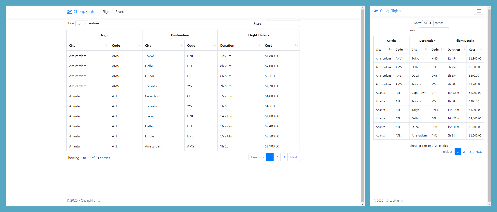
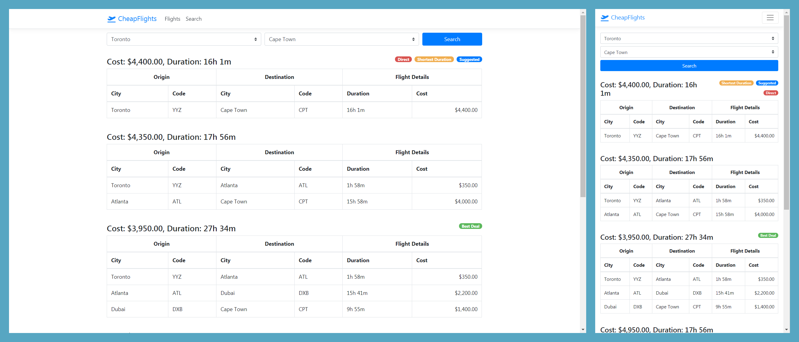

# Cheap Flights
Cheap Flights is a demo webapp with two main features:
1. Viewing all available flights from an internal database
2. Searching for cheapest paths from any origin to destination

## Usage
```
git clone https://github.com/stevenAvery/CheapFlights.git
cd CheapFlights
dotnet restore src
dotnet run --project src
```

## Samples - Desktop and Mobile
### Flights


### Search

